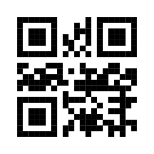

<!-- README.md is generated from README.Rmd. Please edit that file -->
<!-- badges: start -->

[](https://CRAN.R-project.org/package=qrcode)
[](https://www.repostatus.org/#active)
[](https://lifecycle.r-lib.org/articles/stages.html#stable-1)

[](https://app.codecov.io/gh/ThierryO/qrcode)


[](https://doi.org/10.5281/zenodo.5040089)
<!-- badges: end -->

# QRcode Generator for R 

A [QR code](https://en.wikipedia.org/wiki/QR_code) is a two-dimensional
barcode developed by the Denso Wave company.

The current implementation handles three modes: numeric, alphanumeric
and byte. Kanji is currently not supported. Please contact the
maintainer if you need it.

- **Numeric**: only digits from 0 to 9
- **Alphanumeric**: all numeric characters, upper case `LETTERS`, and
  the characters `" "` (space), `"$"`, `"%"`, `"*"`, `"+"`, `"-"`,
  `"."`, `"/"` and `":"`
- **Byte**: All characters from the Latin 1 (ISO 8859-1) character set.

## Main functions

The main `qr_code()` function returns an object of the `qr_code` class.
This is a logical matrix with specific methods for printing and
plotting. The print version uses UTF-8 drawing symbols and the result
depend on the font used. For a better quality QR code it best to use
`plot()` or `generate_svg()`.

``` r
library(qrcode)
code <- qr_code("QR CODE")
print(code)
```

    ##               
    ##  ▗▄▄▄  ▗▗▄▄▄  
    ##  ▐▗▄▐ ▐▟▐▗▄▐  
    ##  ▐▐█▐▐▞▐▐▐█▐  
    ##  ▐▄▄▟▗▚▚▐▄▄▟  
    ##  ▗▖ ▄▖ ▖ ▗▖   
    ##  ▝▄▜▄▌▘▜▚▛▚█  
    ##  ▐▜█▚▀▐██▙▙▞  
    ##  ▗▄▄▄▐▄▞▖▗▟▄  
    ##  ▐▗▄▐▝▖▖▞▗▟▘  
    ##  ▐▐█▐ ▞█▛▄▐▄  
    ##  ▐▄▄▟▐▘▜▀▐▜▝  
    ##               
    ##               
    ## 
    ## use plot() for a better quality image

``` r
plot(code)
```


``` r
generate_svg(code, filename = "man/figures/qr.svg")
```

<figure>

<figcaption aria-hidden="true">A QR code displaying the value ‘QR
CODE’</figcaption>
</figure>

## Installation

The `qrcode` package is available from CRAN, R universe and GitHub.

``` r
# install from CRAN
install.packages("qrcode")
# install from R universe
install.packages("qrcode", repos = "https://thierryo.r-universe.dev")
# install from GitHub use the remotes package
remotes::install_github("ThierryO/qrcode")
```

## Legacy code

The legacy function `qrcode_gen()` had several known bugs. Because of
these bugs, we re-implemented the code from scratch in version 0.1.4. We
created new functions. The old functions are defunct since version
0.2.0. We removed them in version 0.2.2.
